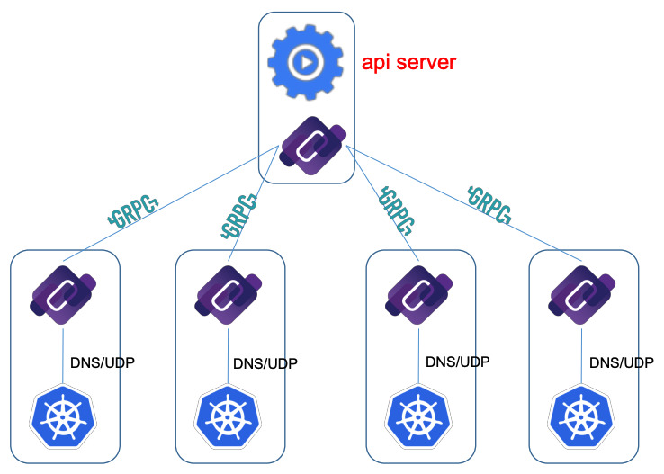

### Topic介绍

CoreDNS over gRPC: Reliable Service Discovery for Kubernetes

虽然在Kubernetes中可以通过多种机制提供服务发现，但DNS是最常用的，并且因其易用性而受到高度推荐。 然而，基于DNS的服务发现的一个挑战是DNS使用的UDP协议的不可靠性质。 无法保证服务记录的查询和响应的发送。

在本次讨论中，我们提供了一种基于gRPC的CoreDNS机制，以解决基于DNS的服务发现的可靠性问题。 作为灵活的DNS服务器，CoreDNS除了传统的UDP之外还能够通过多种协议进行传输。 通过用于节点间通信的DNS over gRPC和用于本地节点DNS服务的普通UDP，我们能够保持易于使用的DNS前端，以便在Kubernetes集群中进行服务发现，与此同时实现急需的可靠性。

资料地址：

- 视频：https://www.youtube.com/watch?v=xd6T2ZEy6y4
- PDF 下载地址：https://schd.ws/hosted_files/kccna18/a4/KubeCon%20-%20CoreDNS%20over%20gRPC.pdf

### Topic摘要

用DNS做服务发现的优点：

- DNS是一种不错且灵活的间接方式
- 对于Dev/DevOps/IT，DNS简单易用
- DNS已存在很长时间并且是现有IT基础设施的一部分
- 适用于混合环境（k8s群集内外）
- DNS本质上是分布式的，非常好

DNS的限制：

- DNS（UDP）不可靠且不安全
- UDP性能可能会误导DNS
- 未使用巨型帧（例如，MTU 9001与AWS上的1500）
- 难以诊断，没有错误代码
- 服务错误 VS DNS基础结构错误

Hard to diagnose, no error code 这个就是真是大问题了。

CoreDNS over gRPC：

- DNS/UDP over local host communications
- gRPC/TLS over cross host communications
- Intermediate CoreDNS (cache) to Kubernetes api server

local host通讯继续用UDP，跨主机通讯则采用 gRPC/TLS，这个思路不错，分而治之。

然后codedns和Kubernetes api server交互，获取数据，再通过gRPC协议和客户端coredns同步信息，这些信息最后可以被应用的客户端用传统的DNS over UDP 方式获取：

CoreDNS over gRPC方案的优势：

- 前端兼容性
	- 相同的DNS方式，可用于服务发现
	- 应用程序没有实现或配置更改
- 可靠，安全的后端通信
- 使用分层缓存可以很好地扩展

优点倒真是挺好的：结合了传统DNS的兼容性和易用性，又能提供足够的可靠性和扩展性，功能也可以通过 CoreDNS 和 k8s 以及其他组件做交互。

非常有创意！
