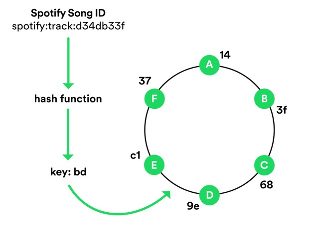

https://labs.spotify.com/2017/03/31/spotifys-lovehate-relationship-with-dns/ 

spotify很拥抱dns

受到spotify的dht一致性hash结合txt记录启发，我觉得naming可以做userid所属zone的查找

输入是一堆信息,客户端hash后形成一个key，去dns query key.svc 的txt记录,dns server维护了zone manager的环，查询得到zone的信息，访问svc.zone
